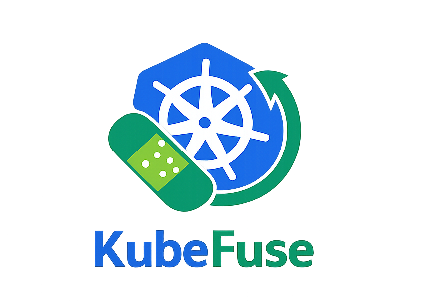

# KubeFuse

**Safe, temporary live-patching for Kubernetes.**

KubeFuse is a CLI tool designed for *on-call and platform engineers* who need to apply **explicit, time-boxed hotfixes** to Kubernetes resources — without permanently drifting from GitOps or Helm.

It applies a patch, annotates the intent, waits for a TTL, and automatically rolls the resource back to its original state.

---

## Why KubeFuse?

Sometimes you need to fix production *now*.

But:
- `kubectl patch` is risky and hard to audit
- GitOps changes can take too long
- Temporary fixes often become permanent by accident

KubeFuse is built for exactly these moments.

---

## Key Features (MVP)

- Patch Kubernetes resources using dot-paths  
  `spec.replicas=2`
- TTL-based rollback (the CLI waits and reverts the change)
- Audit annotations (`reason`, `ttl`)
- Dry-run mode to preview apply & rollback patches
- Resource-aware shell completion (kinds & names)

---

## Installation

### Go install (recommended for Go users)
```sh
go install github.com/iamNoah1/KubeFuse@latest
```

### Release binary (no Go toolchain required)
```sh
curl -LO https://github.com/iamNoah1/KubeFuse/releases/download/v0.1.0/kubefuse_v0.1.0_darwin_arm64.tar.gz
tar -xzf kubefuse_v0.1.0_darwin_arm64.tar.gz
./kubefuse --help
```

---

## Prerequisites

- Access to a Kubernetes cluster
- A working `kubectl` context  
  (KubeFuse uses your existing `KUBECONFIG`)

---

## Quickstart

### Command syntax

```text
kubefuse set <kind/name> <path=value>... [flags]
```

Currently, KubeFuse exposes a single command: **`set`**.

---

### Shell completion

Generate completion scripts:

```sh
kubefuse completion bash
kubefuse completion zsh
kubefuse completion fish
kubefuse completion powershell
```

The `set` command completes resource kinds and names using your current kubeconfig and `--namespace` flag.

---

## Examples

### Scale a deployment temporarily

```sh
kubefuse set deployment/web spec.replicas=3 \
  --ttl 5m \
  --reason "scale for peak"
```

### Add a temporary label in production

```sh
kubefuse set deploy/api -n prod metadata.labels.tier=backend \
  --ttl 30m \
  --reason "temporary label"
```

### Preview without applying (dry-run)

```sh
kubefuse set deployment/web spec.replicas=3 \
  -n default \
  --ttl 5m \
  --reason "scale for peak" \
  --dry-run
```

Example output (values depend on the current resource):

```text
Dry run enabled. No changes applied.
Target: deployment/web
Namespace: default
Reason: scale for peak
TTL: 5m0s

Apply patch:
{
  "metadata": {
    "annotations": {
      "kubefuse.dev/reason": "scale for peak",
      "kubefuse.dev/ttl": "5m0s"
    }
  },
  "spec": {
    "replicas": 3
  }
}

Rollback patch:
{
  "metadata": {
    "annotations": {
      "kubefuse.dev/reason": null,
      "kubefuse.dev/ttl": null
    }
  },
  "spec": {
    "replicas": 1
  }
}
```

---

## How It Works

1. KubeFuse reads the current values at each patch path (and existing audit annotations).
2. It applies your merge patch and adds:
   - `kubefuse.dev/reason`
   - `kubefuse.dev/ttl`
3. If `--dry-run` is set, KubeFuse prints the apply & rollback patches and exits.
4. If a TTL is provided (and not dry-run), the CLI waits and automatically applies a rollback patch.

While waiting, the CLI displays:
- a spinner
- a countdown
- the scheduled rollback time

> Note: the CLI process stays running until the rollback is complete.

---

## Project Status

⚠️ **Early-stage project (MVP)**  
The interface and behavior may still evolve.

Feedback, issues, and ideas are very welcome.

---

## Contributing

See `CONTRIBUTING.md`.

---

## License

MIT
